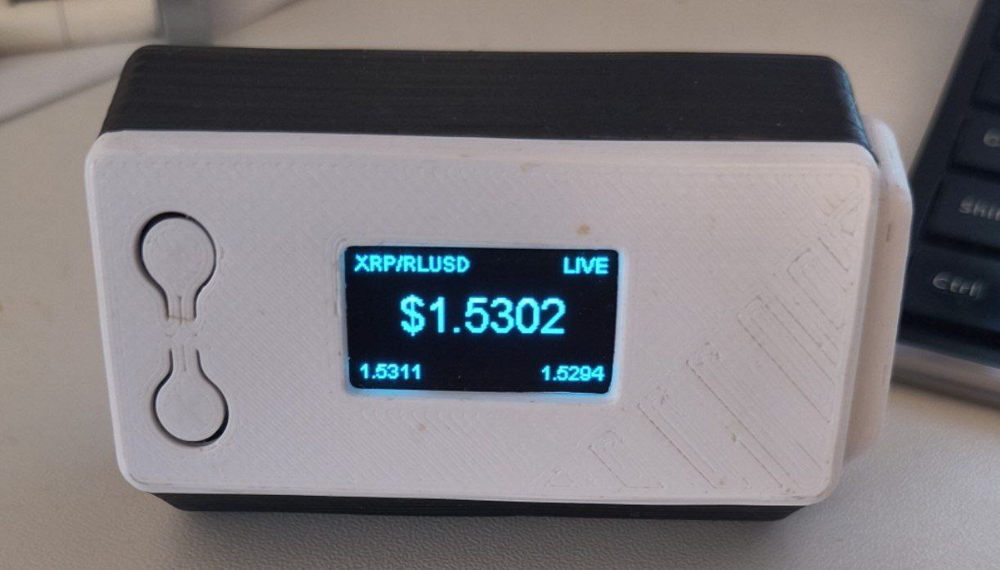

# XRP Price Ticker

Live XRP price from the XRPL DEX displayed on a Heltec WiFi LoRa 32 V3.



## Features

- **Real-time pricing** from the XRPL decentralized exchange
- **Configurable trading pairs** - XRP/USD, XRP/RLUSD, XRP/SOLO, or any issued currency
- **Price change alerts** - Screen inverts when price moves beyond threshold
- **Percent change indicator** - Shows ▲/▼ with % change from recent price
- **Bid/Ask spread** displayed at bottom
- **Secure WebSocket** connection to XRPL nodes
- **Configurable update interval**

## Hardware

- [Heltec WiFi LoRa 32 V3](https://heltec.org/project/wifi-lora-32-v3/) (ESP32-S3 with built-in OLED)

Other ESP32 boards with SSD1306 OLED displays should work with pin configuration changes.

## Quick Start

### 1. Install PlatformIO

Install [PlatformIO IDE](https://platformio.org/install/ide?install=vscode) for VS Code, or the [PlatformIO CLI](https://platformio.org/install/cli).

### 2. Clone and Configure

```bash
git clone https://github.com/justinnevins/xrp-ticker.git
cd xrp-ticker

# Create your config file
cp include/config.h.example include/config.h
```

Edit `include/config.h` with your settings:

```c
// Your WiFi
#define WIFI_SSID "YourWiFiName"
#define WIFI_PASSWORD "YourWiFiPassword"

// Trading pair (see config.h.example for presets)
#define QUOTE_CURRENCY "USD"
#define QUOTE_ISSUER "rvYAfWj5gh67oV6fW32ZzP3Aw4Eubs59B"
#define QUOTE_SYMBOL "$"
#define DISPLAY_LABEL "XRP/USD"
```

### 3. Build and Upload

```bash
# Using PlatformIO CLI
pio run -t upload

# Monitor serial output (optional)
pio device monitor
```

## Configuration Options

### Trading Pairs

The ticker shows XRP priced in your chosen quote currency. Edit `config.h`:

| Pair | QUOTE_CURRENCY | QUOTE_ISSUER | Notes |
|------|----------------|--------------|-------|
| XRP/USD | `USD` | `rvYAfWj5gh67oV6fW32ZzP3Aw4Eubs59B` | Bitstamp USD |
| XRP/RLUSD | `524C555344000000000000000000000000000000` | `rMxCKbEDwqr76QuheSUMdEGf4B9xJ8m5De` | Ripple USD |
| XRP/SOLO | `534F4C4F00000000000000000000000000000000` | `rsoLo2S1kiGeCcn6hCUXVrCpGMWLrRrLZz` | Sologenic |

For other currencies, find the issuer address on [xrpscan.com/tokens](https://xrpscan.com/tokens) or your preferred explorer.

### XRPL Nodes

Public nodes (recommended for most users):
- `xrplcluster.com` (port 443) - Community cluster
- `s1.ripple.com` (port 443) - Ripple's public node
- `s2.ripple.com` (port 443) - Ripple's public node

Or use your own node for lower latency.

### Update Interval

```c
#define PRICE_UPDATE_INTERVAL 5000  // milliseconds
```

Lower values = more responsive, but more load on the XRPL node. Recommended: 1000-10000ms.

### Price Alerts

Configure alerts when price moves significantly:

```c
// Alert when price changes more than 2%
#define ALERT_THRESHOLD_PERCENT 2.0

// Compare to price from 5 minutes ago
#define ALERT_TIME_WINDOW_MS 300000

// Invert display for 3 seconds when alert triggers
#define ALERT_FLASH_DURATION_MS 3000
```

When triggered, the display inverts (white on black → black on white) to catch your attention. The ▲/▼ indicator always shows current % change from the configured time window.

## Display Layout

```
XRP/USD              LIVE
                         
      $2.4532           
       ▲ 1.25%          
2.4530            2.4534
```

- **Top left:** Trading pair label
- **Top right:** Connection status (LIVE / ...)
- **Center:** Mid-price (large font)
- **Below price:** Change indicator (▲/▼ with %)
- **Bottom:** Bid (left) / Ask (right) spread

When a price alert triggers (change exceeds threshold), the entire display inverts colors for visibility.

## Troubleshooting

### WiFi won't connect
- Verify credentials in `config.h`
- ESP32 only supports 2.4GHz networks (not 5GHz)
- Check serial monitor for status

### WebSocket connection fails
- Try a different XRPL node
- Test node connectivity: `wscat -c wss://xrplcluster.com`
- Check if your network blocks WebSocket connections

### No price displayed
- The trading pair may have low liquidity on the DEX
- Check serial monitor for error messages
- Verify the issuer address is correct

### Display issues
- Ensure proper I2C pin configuration for your board
- Try power cycling the device

## How It Works

1. Connects to WiFi
2. Opens secure WebSocket to an XRPL node
3. Queries the DEX order book for the configured pair
4. Calculates mid-price from best bid/ask
5. Updates the OLED display
6. Repeats at configured interval

The ticker queries both sides of the order book to show the spread and calculate an accurate mid-price.

## License

MIT License - see [LICENSE](LICENSE)

## Contributing

Pull requests welcome! Please test on actual hardware before submitting.

## Credits

Built with:
- [ArduinoWebsockets](https://github.com/gilmaimon/ArduinoWebsockets)
- [ArduinoJson](https://arduinojson.org/)
- [ESP8266 and ESP32 OLED driver](https://github.com/ThingPulse/esp8266-oled-ssd1306)
